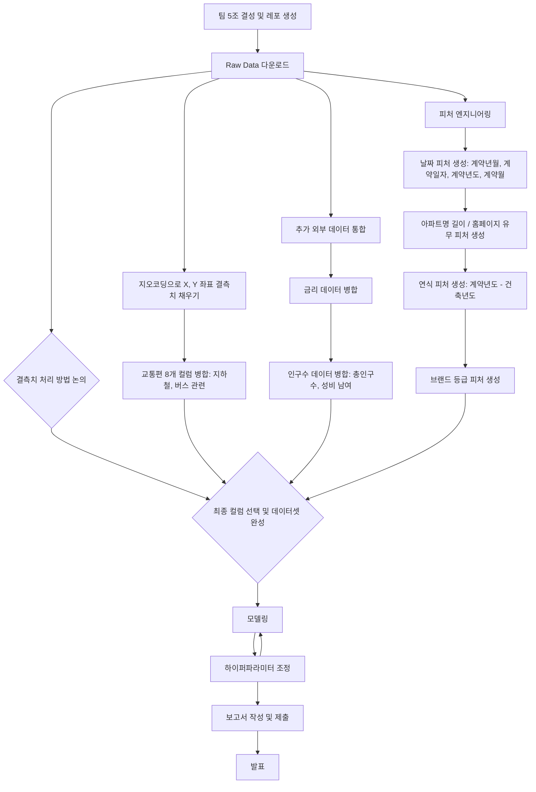

# 🏠 Seoul House Price ML Challenge

## Team


|  |  |  |  |
| :--------------------------------------------------------------: | :--------------------------------------------------------------: | :--------------------------------------------------------------: | :--------------------------------------------------------------: |
| [김선민](https://github.com/nimnusmik) | [김장원](https://github.com/jkim1209) | [최현화](https://github.com/iejob) | [장윤정](https://github.com/yjjang06) |
| 팀장, 담당 역할 | 데이터 수집, 전처리, 모델링 | DE / FE / QA / ML | 모델링 |

## 1. Competiton Info

### Overview
- 본 아파트 가격 예측 챌린지는 참가자들이 서울 아파트의 실제 거래 가격을 정확하고 일반화된 모델로 예측하는 것을 목표로 합니다.

미리 시장 동향을 예측함으로써, 모델은 현명한 부동산 의사결정을 돕고 공정하며 효율적인 거래를 촉진할 수 있습니다. 참가자들은 또한 데이터 과학 및 머신러닝 분야에서 실질적인 경험을 쌓고, 다양한 아파트 특성 간의 관계를 탐구할 수 있습니다.

저희 팀5조의 서울 부동산 가격 예측 프로젝트 플로우는 다음과 같이 진행했습니다.



### Timeline

- 모델링 전(7/7–7/11)
    - 7/7–7/8: 주제 정의·데이터 구조 탐색
    - 7/9–7/11: 외부 데이터 수집·결측치 처리·피처 엔지니어링
    - 회의:
        - 매일 **10:10** 스탠드업 (당일 목표·이슈 공유)
        - 매일 **18:30** 진행 상황 점검
    
- 모델링 전환(7/12–7/13)
    - 7/12–7/13:
        - A조 Insight 정리 (타깃 관계 분석·문서화)
        - B조 Feat Eng 분업 (이상치 처리·스케일링·인코딩·간단 모델링)
    - 회의: 매일 **18:00** 모델링 준비 회의

- **모델링·최종 검증(7/14–7/17)**
    - **7/14–7/17**: 모델 학습·추가 피처링 병행·최종 RMSE 검증
    - **회의**: 매일 **18:00** 결과 공유 회의


### Dev Environments

```bash
.
├── data
│ ├── logs
│ │ ├── geocoding_logs
│ │ ├── price_prediction_logs
│ │ └── transportation-features_logs
│ ├── processed
│ │ ├── cleaned_data
│ │ ├── geocoding
│ │ ├── params
│ │ ├── price-prediction
│ │ ├── submissions
│ │ └── transportation-features
│ └── raw
├── docs
│ └── pdf
├── font
│ └── NanumFont
├── images
│ └── price_prediction_hyunhwa
├── model
│ └── price_prediction_hyunhwa
├── notebooks
│ ├── csv
│ ├── geocoding-missing-coords
│ ├── price-prediction
│ └── transportation-features
└── src
├── data
└── log
└── pycache
```

## 디렉토리별 설명

1. data: 프로젝트의 모든 데이터(csv) 관련 파일 보관소
    
    • logs: 지오코딩·모델 학습·교통 피처 생성 과정의 로그
    
    • processed: 클리닝·지오코딩·파라미터·최종 예측·제출 파일 등 가공 데이터
    
    • raw: 제공받은 원본 CSV 파일(bus_feature, loanrate, population, subway_feature, train/test.csv)
    

1. docs: 프로젝트 산출물 및 템플릿용 PPT 파일
2. font : NanumGothic 폰트 파일
3. images: 모델별 시각화 이미지(피처 중요도, SHAP, 학습 곡선 등)
4. model: 버전별 학습된 모델 객체(.pkl)
5. notebooks: 주피터 파일 저장
    
    • csv: CSV 비교·리사이즈·제출 포맷용 실험 노트북
    
    • geocoding-missing-coords: 좌표 결측치 탐색 및 지오코딩 노트북
    
    • transportation-features: 교통 관련 파생변수 생성 노트북
    
    • price-prediction: 1~9버전 모델링 실험 노트북
    
6. src: python 파일 저장
    
    • data: 데이터 다운로드·정제·피처 엔지니어링·모델링 스크립트
    
    • log: 로거 구현 및 캐시 파일(**pycache**)


---

### Evaluation
- _Write how to evaluate model_

## 2. Components

### Directory

## 3. Data descrption

### Dataset overview

•	Input: 9,272 records of apartment features and transaction details
•	Output: Predicted transaction prices for these 9,272 apartments

### EDA

- _Describe your EDA process and step-by-step conclusion_

### Feature engineering

- _Describe feature engineering process_

## 4. Modeling

### Model descrition

- _Write model information and why your select this model_

### Modeling Process

- _Write model train and test process with capture_

## 5. Result

### Leader Board

> 최종 점수: 46950.6270


### Presentation

- _Insert your presentaion file(pdf) link_

## etc

### Meeting Log

- _Insert your meeting log link like Notion or Google Docs_

### Reference

- _Insert related reference_
