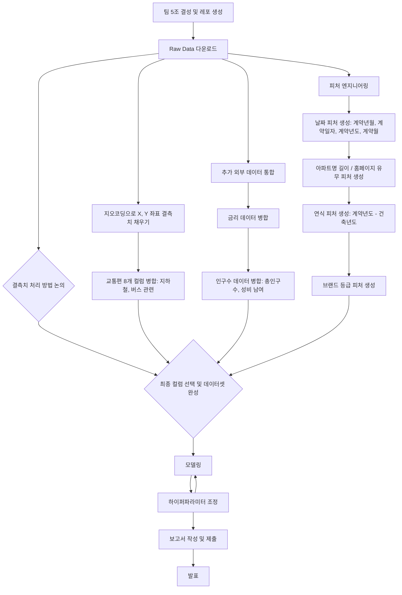

# 🏠 Seoul House Price ML Challenge

## Team

|  |  |  |  |  |
| :--------------------------------------------------------------: | :--------------------------------------------------------------: | :--------------------------------------------------------------: | :--------------------------------------------------------------: | :--------------------------------------------------------------: |
|            [김선민](https://github.com/nimnusmik)             |            [이패캠](https://github.com/UpstageAILab)             |            [최패캠](https://github.com/UpstageAILab)             |            [장윤정](https://github.com/yjjang06)             |            [오패캠](https://github.com/UpstageAILab)             |
|                            팀장, 담당 역할                             |                            담당 역할                             |                            담당 역할                             |                            담당 역할                             |                            담당 역할                             |

## 1. Competiton Info

### Overview
- 본 아파트 가격 예측 챌린지는 참가자들이 서울 아파트의 실제 거래 가격을 정확하고 일반화된 모델로 예측하는 것을 목표로 합니다.

미리 시장 동향을 예측함으로써, 모델은 현명한 부동산 의사결정을 돕고 공정하며 효율적인 거래를 촉진할 수 있습니다. 참가자들은 또한 데이터 과학 및 머신러닝 분야에서 실질적인 경험을 쌓고, 다양한 아파트 특성 간의 관계를 탐구할 수 있습니다.

저희 팀5조의 서울 부동산 가격 예측 프로젝트 플로우는 다음과 같이 진행했습니다.

### Timeline

- ex) July 7, 2025 - Start Date
- ex) July 17, 2025 - Final submission deadline

### Evaluation

- _Write how to evaluate model_

## 2. Components

### Directory

- _Insert your directory structure_

## 3. Data descrption

### Dataset overview

•	Input: 9,272 records of apartment features and transaction details
•	Output: Predicted transaction prices for these 9,272 apartments

### EDA

- _Describe your EDA process and step-by-step conclusion_

### Feature engineering

- _Describe feature engineering process_

## 4. Modeling

### Model descrition

- _Write model information and why your select this model_

### Modeling Process

- _Write model train and test process with capture_

## 5. Result

### Leader Board

- _Insert Leader Board Capture_
- _Write rank and score_

### Presentation

- _Insert your presentaion file(pdf) link_

## etc

### Meeting Log

- _Insert your meeting log link like Notion or Google Docs_

### Reference

- _Insert related reference_
