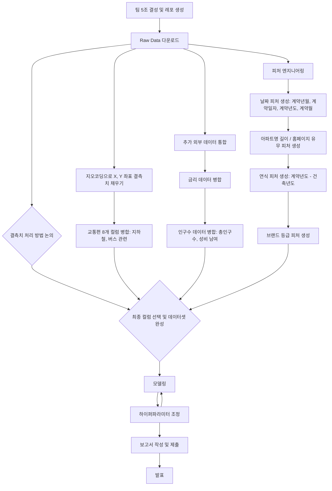

# 🏠 Seoul House Price ML Challenge

본 프로젝트는 2025년 7월 진행된 **서울시 아파트 실거래가 예측** 머신러닝 경진대회의 결과물입니다. 회귀(Regression) 문제 해결을 목표로, 데이터 엔지니어링부터 모델링, 협업까지 전 과정을 담았습니다.

## 🚀 핵심 요약 (TL;DR)

- **주제**: 서울시 아파트 실거래가 예측을 위한 머신러닝 회귀 모델 개발
- **팀**: `3X+Y` (AI·통계·컴퓨터공학 전공 4인)
- **주요 기술**: Feature Engineering, Time Series CV, Ensemble (Voting, Stacking), XGBoost, LightGBM, CatBoost
- **핵심 성과**: 최종 RMSE **46,950** (대회 5위), 체계적인 협업 프로세스 구축
- **핵심 교훈**: 데이터 품질의 중요성, 시계열 특성 고려의 필요성, 모델 설명 가능성의 가치

## Team

## 👨‍💻 팀: 3X+Y

> "한 줄의 코드, 한 뼘의 통찰. 정확한 예측 모델을 향하여!"
> 

‘3X+Y’는 팀원들의 MBTI 유형 분포가 ‘3:1’인 점에서 착안한 이름입니다. AI, 금융·통계, 컴퓨터공학 등 다양한 배경을 가진 팀원들이 모여 시너지를 만들었습니다.


|  |  |  |  |
| :--------------------------------------------------------------: | :--------------------------------------------------------------: | :--------------------------------------------------------------: | :--------------------------------------------------------------: |
| [김선민](https://github.com/nimnusmik) | [김장원](https://github.com/jkim1209) | [최현화](https://github.com/iejob) | [장윤정](https://github.com/yjjang06) |
| 팀 매니징 및 모델링 | 데이터 수집, 전처리, 모델링, 발표 | DE / FE / QA / ML, 깃헙 관리 | 모델링 |


## Overview

### 프로젝트 배경 및 목적

부동산 시장에서 아파트 가격 예측은 구매자와 판매자 모두의 합리적인 의사결정을 돕는 중요한 과제입니다.

본 경진대회는 서울시 실거래가 데이터를 활용해 정확한 예측 모델을 개발하는 것을 목표로 하였으며, 저희 팀은 순위 경쟁을 넘어 데이터 전처리부터 모델링까지 전 과정을 직접 수행하며 실질적인 경험을 쌓는 데 중점을 두었습니다.

저희 5조의 프로젝트 진행 과정은 다음과 같습니다.

### 경진대회 개요

- 기간: 2025년 7월 7일 ~ 7월 17일
- 주제: 서울시 아파트 실거래가 예측 (Regression 문제)
- 주요 목표: 데이터 엔지니어링, 피처 엔지니어링, 모델링 과정 완성 및 설명 가능성 강조



## 🤝 협업 방식 및 도구

### 협업 도구 및 전략

- **Slack & Notion**: 실시간 커뮤니케이션, 회의 일정 공유, 질의응답
- **GitHub Issues & PR**: 작업 책임자 지정, 이슈 유형별 라벨링, 프로젝트 보드 관리, 코드 리뷰 및 병합
- **Google Drive**: 대용량 데이터 저장, 버전 관리, 문서 공동 편집

### 협업 마인드셋

- 열린 소통: 모르는 부분 즉시 질문 및 공유
- 상호 존중 및 건설적 피드백
- 책임감 있는 업무 완수
- 주도적 문제 해결 및 제안

정기적으로 하루 2회(아침, 저녁) 미팅을 진행하며 약 70개의 이슈를 체계적으로 관리했습니다.

---

## Timeline

- 모델링 전(7/7–7/11)
    - 7/7–7/8: 주제 정의·데이터 구조 탐색
    - 7/9–7/11: 외부 데이터 수집·결측치 처리·피처 엔지니어링
    - 회의:
        - 매일 **10:10** 스탠드업 (당일 목표·이슈 공유)
        - 매일 **18:30** 진행 상황 점검
    
- 모델링 전환(7/12–7/13)
    - 7/12–7/13:
        - A조 Insight 정리 (타깃 관계 분석·문서화)
        - B조 Feat Eng 분업 (이상치 처리·스케일링·인코딩·간단 모델링)
    - 회의: 매일 **18:00** 모델링 준비 회의

- **모델링·최종 검증(7/14–7/17)**
    - **7/14–7/17**: 모델 학습·추가 피처링 병행·최종 RMSE 검증
    - **회의**: 매일 **18:00** 결과 공유 회의


### Dev Environments

```bash
.
├── data
│ ├── logs
│ │ ├── geocoding_logs
│ │ ├── price_prediction_logs
│ │ └── transportation-features_logs
│ ├── processed
│ │ ├── cleaned_data
│ │ ├── geocoding
│ │ ├── params
│ │ ├── price-prediction
│ │ ├── submissions
│ │ └── transportation-features
│ └── raw
├── docs
│ └── pdf
├── font
│ └── NanumFont
├── images
│ └── price_prediction_hyunhwa
├── model
│ └── price_prediction_hyunhwa
├── notebooks
│ ├── csv
│ ├── geocoding-missing-coords
│ ├── price-prediction
│ └── transportation-features
└── src
├── data
└── log
└── pycache
```

### Directory Description 

1. data: 프로젝트의 모든 데이터(csv) 관련 파일 보관소
    
    • logs: 지오코딩·모델 학습·교통 피처 생성 과정의 로그
    
    • processed: 클리닝·지오코딩·파라미터·최종 예측·제출 파일 등 가공 데이터
    
    • raw: 제공받은 원본 CSV 파일(bus_feature, loanrate, population, subway_feature, train/test.csv)
    

1. docs: 프로젝트 산출물 및 템플릿용 PPT 파일
2. font : NanumGothic 폰트 파일
3. images: 모델별 시각화 이미지(피처 중요도, SHAP, 학습 곡선 등)
4. model: 버전별 학습된 모델 객체(.pkl)
5. notebooks: 주피터 파일 저장
    
    • csv: CSV 비교·리사이즈·제출 포맷용 실험 노트북
    
    • geocoding-missing-coords: 좌표 결측치 탐색 및 지오코딩 노트북
    
    • transportation-features: 교통 관련 파생변수 생성 노트북
    
    • price-prediction: 1~9버전 모델링 실험 노트북
    
6. src: python 파일 저장
    
    • data: 데이터 다운로드·정제·피처 엔지니어링·모델링 스크립트
    
    • log: 로거 구현 및 캐시 파일(**pycache**)


## EDA
1. 결측치 현황 파악
  - 전체 52개 컬럼 중 41개 컬럼 결측치 존재
  - 이 중 37개 컬럼의 결측치 비율 70% 이상
  - 공백 등 의미없는 값으로 채워진 컬럼도 존재
2. 결측치 탐색 및 처리 방향
  - 최빈값, 0등으로 대체하는 방식 시뮬레이션 진행
  - 값 유무에 따라 0/1 또는 공백으로 대체하는 방식 검토
  - `좌표X`, `좌표Y` 결측치 보완을 위해 지오코딩 적용 검토
3. 외부 데이터 조사 및 통합
  - **주택담보대출금리**가 집값에 영향을 줄 수 있다고 생각하여 금리 데이터 추가
  - **인구 밀도**가 집값에 영향을 줄 수 있다고 생각하여 인구 데이터 추가
4. 모델 학습용 컬럼 확정
  - 위 결과를 바탕으로 학습에 사용할 컬럼 확정

## Feature engineering
1. 결측치 처리
  - 결측치가 많은 변수 중, 논리적·직관적으로 필요 없다고 판단되는 변수들 제거
  - 교통 관련 파생변수 생성을 위해 `좌표X`, `죄표Y` 결측치 지오코딩을 이용하여 보완
  - `아파트명`, `단지분류` 등의 결측치 빈문자열('')로 처리
  - `홈페이지`, `사용허가여부` 등의 결측치는 값 유/무 여부를 1/0으로 처리
3. 날짜 변수
  - `계약일자` -> `계약년도`, `계약월`로 분리
  - `건축년도`와 `계약년도`를 조합하여 `연식` 파생변수 생성
3. 지역 및 교통 관련 변수
  - `시군구` -> `자치구`, `법정동`으로 분리
  - `강남3구여부`(강남, 서초, 송파) 파생변수 생성
  - 교통 관련 파생변수 추가
    - `지하철·버스 최단거리`
    - `300m/500m/1km 반경 지하철역/버스정류장 수`
4. 기타 파생 변수
  - 한국기업평판연구소 브랜드평판지수를 기반으로 `아파트명`을 통해 `브랜드등급`(기타, 하이엔드, 프리미엄) 파생변수 추가 
5. 외부 변수 추가
  - 인구수 관련 변수 : `총인구수`, `성비(남/여)` 추가
  - 대출금리 관련 변수 : `loanrate_1m`, `loanrate_3m`, `loanrate_6m`, `loanrate_12m` 추가

## Modeling 전략

- 모델: XGBoost, LightGBM, CatBoost, RandomForest, Stacking, Voting
- 교차검증: 시계열 기반 K-Fold 적용
- 타겟 변수 로그 변환(np.log1p)
- 성능 개선 전략:
    - 성능 낮은 컬럼 제거(Lasso 회귀 기반)
    - 시계열 특성 고려한 학습·검증
    - Voting/Stacking 앙상블 적용
    - AutoInt(DeepCTR) 모델 실험 → 복잡한 비선형 피처 간 상호작용 고려
- **교차 검증**: 시계열 데이터의 특성을 고려하여 **Time Series K-Fold CV**를 적용, 일반화 성능 확보
- **타겟 변환**: 가격(`target`) 분포의 왜도를 줄이기 위해 **로그 변환 (`np.log1p`)** 을 적용
- **앙상블**: 최종적으로 **Voting** 및 **Stacking** 앙상블을 통해 모델의 안정성과 정확도를 높임
- **딥러닝 실험**: **AutoInt** 모델을 도입하여 고차원 피처 상호작용 학습을 시도함

---

## 분석 인사이트 및 결과

- 공변량 시프트 문제 해결:
    - train: 2007~2023.06 / test: 2023.07~09 간 차이
    - train 데이터의 후반부만 사용하여 일반화 성능 확보
- 중요 피처:
    - 전용면적, 계약년월, 연식, 강남3구여부
- 주요 개선:
    - 자치구 대신 좌표 사용
    - 교통변수는 가중치합 사용
    - 모델 성능 향상에 기여하지 못한 컬럼 제거
    - Lasso 회귀로 불필요 피처 제거
- RMSE 개선:
    - 최종 제출 모델 GB_v4 기준 RMSE: **46950.62**

**김장원 – 선형 및 비선형 모델을 통한 인사이트**

- LASSO 회귀를 이용해 변수 중요도를 파악, ‘인구비중’, ‘자치구_구로구’ 등 중요하지 않은 변수 제외
- 시계열 데이터 특성을 고려하지 않은 무작위 K-F출
- K-Means 군집화를 통해 지리적·물리적 유사 아파트 군집 생성
- 전용면적과 건물나이의 상호작용 피처가 가격 예측 핵심임을 확인
- 기존 무작위 데이터 분할에 의한 비현실적 성능 지표 문제를 발견하고 시계열 기반 검증 도입
- 단일 모델 편향성 문제를 인지하고 LightGBM과 CatBoost 앙상블로 예측 안정성 향상
- 모델 설명 가능성 및 신뢰성 확보를 위해 ‘왜’ 예측하는지에 대한 이해 중요성 강조
- 
**김선민 – 데이터 시계열 특성 및 피처 개선 인사이트**

- 훈련 데이터와 테스트 데이터 간 공변량 시프트 문제 확인 (훈련 데이터는 장기간, 테스트 데이터는 최근 3개월 집중)
- ‘전용면적’, ‘계약년월’, ‘연식’, ‘강남3구 여부’가 핵심 변수임을 확인
- 시계열 차이를 반영한 피처 생성 및 불필요 변수 제거로 모델 신뢰성 및 성능 향상
- 딥러닝 모델(AutoInt)을 도입해 복잡한 비선형 상호작용 학습 시도, 하지만 L2 규제 등 모델 일반화 한계도 발견

**장윤정 – 다양한 모델 실험 및 지역 변수 처리**

- Linear, RandomForest, XGBoost, LightGBM 등 다양한 모델 실험
- XGBoost가 가장 우수한 성능을 보였고, 시군구 지역 변수는 카디널리티 문제로 직접 적용 어려워 ‘강남3구 여부’ 파생 변수 활용
- 예측값과 실제값 간 회귀선 분석을 통해 절편 문제 및 추가 개선점 도출

**최현화 – 피처 엔지니어링 및 모델링 개선**
- Geocoding API로 좌표 결측치 채울시 먼저 ‘시군구 + 번지’ 조합으로 주소를 생성해 Google Geocoding API를 호출후,
  API 검색이 실패하면 ‘시군구 + 도로명’으로 재시도하고, 여전히 좌표를 찾지 못할 땐 도로명에서 ‘동/가/로’ 뒤끝을 제거한 주소를 다시 조회.
  결과 test.csv(9,272건/100%), train.csv는 8,721 결측행 제거 후 총 1,110,101건의 모든 좌표 결측치를 안정적으로 채울
- X·Y 좌표를 활용해 버스·지하철 역 위치 데이터를 BallTree 구조로 로드하고,
  역·정류장까지의 최단거리, 반경 1 km, 500 m, 300 m 내 역·정류장 개수 총 8개의 교통 편의성 지표를 원본 데이터에 추가
- K-Means 군집화를 통해 지리적·물리적 유사 아파트 군집 생성
- 전용면적과 건물나이의 상호작용 피처가 가격 예측 핵심임을 확인
- 기존 무작위 데이터 분할에 의한 비현실적 성능 지표 문제를 발견하고 시계열 기반 검증 도입
- 단일 모델 편향성 문제를 인지하고 LightGBM과 CatBoost 앙상블로 예측 안정성 향상
- 모델 설명 가능성 및 신뢰성 확보를 위해 ‘왜’ 예측하는지에 대한 이해 중요성 강조
---

## Evaluation

### RMSE (Root Mean Squared Error)

$$
\text{RMSE} = \sqrt{\frac{1}{N} \sum_{i=1}^{N} (y_i - \hat{y}_i)^2}
$$

- $N$: 데이터 포인트의 수
- $y_i$: 실제 가격
- $\hat{y}_i$: 모델의 예측 가격

### Meeting Log

- [notion](https://www.notion.so/21d40cb3731d80f18df4e07c93787261?pvs=21)

---

## 📊 결과 및 주요 인사이트

### 최종 결과

- **Evaluation Metric**: RMSE (Root Mean Squared Error)
- **Leader Board Score**: **46950.6270** (5위)

### 핵심 인사이트

1. **공변량 시프트(Covariate Shift) 대응**: 학습 데이터(2007~2023.06)와 테스트 데이터(2023.07~09) 간 분포 차이를 인지하고, **최신 데이터(2013년 10월 이후) 중심의 학습**을 통해 성능을 개선했습니다.
2. **피처의 중요성**: `전용면적`, `계약년월`, `연식`, `강남3구여부`가 예측의 핵심 변수임을 확인했습니다. `자치구` 같은 넓은 범주보다 `좌표`와 `군집` 정보가 더 효과적이었습니다.
3. **모델 설명 가능성**: 모델의 예측 성능만큼 **‘왜’** 그렇게 예측하는지 이해하는 과정이 모델 신뢰도 제고와 개선에 필수적임을 깨달았습니다.


---

## 💡 회고 (Retrospective)

**목표 달성도 및 성과**

초기 목표였던 ‘팀원 모두가 데이터 전처리부터 모델링까지 전 과정 경험’은 성공적으로 달성되었습니다. 
개인별 아이디어를 바탕으로 전 과정을 수행하며 역량을 내재화했고, 팀으로서 서울시 아파트 실거래가 예측 경진대회에서 5위(RMSE 46950.6270)라는 우수한 성과를 거두었습니다. 
결과적으로 개인 성장과 팀 경쟁력 두 마리 토끼를 잡는 의미 있는 프로젝트였습니다.


**협업 및 커뮤니케이션**

GitHub Issues, Slack, Notion을 활용해 업무를 실시간으로 관리하고 진행 상황을 투명하게 공유했다.

- GitHub를 ‘단일 진실의 출처’로 활용해 계획, 실행, 검증 과정을 기록
- 기능별 브랜치 및 PR 워크플로우로 코드 안정성 확보
- Slack을 통한 실시간 소통과 회의 일정 공유, 리마인더 제공
- Notion으로 업무 대시보드화 및 아이디어 정리

이러한 체계적인 협업 방식이 프로젝트 성공에 큰 기여를 했다.

**아쉬웠던 점 및 개선 사항**

- 결측치 대체 방법 시뮬레이션에 시간이 많이 소요되어 최종 컬럼 확정이 지연
- 피처 엔지니어링에 많은 시간 투입으로 모델링 실험 시간이 부족
- 다양한 모델 실험 과정에서 학습 대기 시간이 길어 심층 학습 기회 제한
- 경진대회 마감 직전에서야 첫 결과 제출을 시작해 성능 차이 분석 및 개선 시간이 부족
- 초기에 예측 결과를 지속 제출하는 전략이 부족해 결과 개선에 한계
- 
### 팀원별 소감

- **김선민**: 결과 지표에 매몰되기보다, 현상을 깊이 이해하고 ‘왜’를 질문하는 과정의 중요성을 깨달았습니다.
- **김장원**: "Garbage in, Garbage out." 좋은 데이터와 도메인 지식이 모델 성능을 좌우함을 실감했습니다.
- **장윤정**: 전반적인 분석/모델링 경험을 통해, 앞으로 더 다양한 가설을 세우고 실험하는 역량을 키우고 싶습니다.
- **최현화**: 라이브러리 사용을 넘어 모델의 작동 원리를 탐구하고, 문제에 맞는 최적의 해결책을 설계하는 엔지니어가 되겠습니다.


본 경진대회 사례는 머신러닝 프로젝트에서 데이터의 이해와 전처리, 체계적 협업, 그리고 다양한 모델링 전략의 중요성을 극명하게 보여줍니다. 
특히 시계열 특성을 고려한 검증과 피처 엔지니어링이 모델 성능을 좌우하며, 앙상블과 딥러닝 모델의 조합이 예측 정확도를 높였습니다. 
팀원 모두가 전 과정을 경험하며 개인과 팀의 역량을 함께 성장시킨 점이 가장 큰 성과라 할 수 있습니다. 
향후 프로젝트에서는 초기 예측 결과의 빠른 제출과 피드백, 다양한 모델 심층 탐색이 더욱 보완되어야 할 과제로 남았습니다.

---

### Reference

- 한국기업평판연구소: https://brikorea.com/
- 주택 관련 논문:
    - https://www.kdi.re.kr/upload/7837/1_1.pdf
    - https://www.emerald.com/insight/content/doi/10.1108/jfm-02-2016-0003/full/html
- *Insert related reference*
