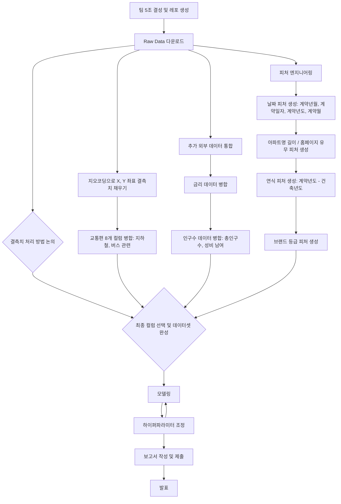

# 🏠 Seoul House Price ML Challenge

## Team


|  |  |  |  |
| :--------------------------------------------------------------: | :--------------------------------------------------------------: | :--------------------------------------------------------------: | :--------------------------------------------------------------: |
| [김선민](https://github.com/nimnusmik) | [김장원](https://github.com/jkim1209) | [최현화](https://github.com/iejob) | [장윤정](https://github.com/yjjang06) |
| 팀장, 담당 역할 | 데이터 수집, 전처리, 모델링 | DE / FE / QA / ML | 모델링 |

## 1. Competiton Info

## Overview

- 본 아파트 가격 예측 챌린지는 참가자들이 서울 아파트의 실제 거래 가격을 정확하고 일반화된 모델로 예측하는 것을 목표로 합니다.

미리 시장 동향을 예측함으로써, 모델은 현명한 부동산 의사결정을 돕고 공정하며 효율적인 거래를 촉진할 수 있습니다. 참가자들은 또한 데이터 과학 및 머신러닝 분야에서 실질적인 경험을 쌓고, 다양한 아파트 특성 간의 관계를 탐구할 수 있습니다.

저희 팀5조의 서울 부동산 가격 예측 프로젝트 플로우는 다음과 같이 진행했습니다.



## Timeline

- 모델링 전(7/7–7/11)
    - 7/7–7/8: 주제 정의·데이터 구조 탐색
    - 7/9–7/11: 외부 데이터 수집·결측치 처리·피처 엔지니어링
    - 회의:
        - 매일 **10:10** 스탠드업 (당일 목표·이슈 공유)
        - 매일 **18:30** 진행 상황 점검
    
- 모델링 전환(7/12–7/13)
    - 7/12–7/13:
        - A조 Insight 정리 (타깃 관계 분석·문서화)
        - B조 Feat Eng 분업 (이상치 처리·스케일링·인코딩·간단 모델링)
    - 회의: 매일 **18:00** 모델링 준비 회의

- **모델링·최종 검증(7/14–7/17)**
    - **7/14–7/17**: 모델 학습·추가 피처링 병행·최종 RMSE 검증
    - **회의**: 매일 **18:00** 결과 공유 회의


### Dev Environments

```bash
.
├── data
│ ├── logs
│ │ ├── geocoding_logs
│ │ ├── price_prediction_logs
│ │ └── transportation-features_logs
│ ├── processed
│ │ ├── cleaned_data
│ │ ├── geocoding
│ │ ├── params
│ │ ├── price-prediction
│ │ ├── submissions
│ │ └── transportation-features
│ └── raw
├── docs
│ └── pdf
├── font
│ └── NanumFont
├── images
│ └── price_prediction_hyunhwa
├── model
│ └── price_prediction_hyunhwa
├── notebooks
│ ├── csv
│ ├── geocoding-missing-coords
│ ├── price-prediction
│ └── transportation-features
└── src
├── data
└── log
└── pycache
```

### Directory Description 

1. data: 프로젝트의 모든 데이터(csv) 관련 파일 보관소
    
    • logs: 지오코딩·모델 학습·교통 피처 생성 과정의 로그
    
    • processed: 클리닝·지오코딩·파라미터·최종 예측·제출 파일 등 가공 데이터
    
    • raw: 제공받은 원본 CSV 파일(bus_feature, loanrate, population, subway_feature, train/test.csv)
    

1. docs: 프로젝트 산출물 및 템플릿용 PPT 파일
2. font : NanumGothic 폰트 파일
3. images: 모델별 시각화 이미지(피처 중요도, SHAP, 학습 곡선 등)
4. model: 버전별 학습된 모델 객체(.pkl)
5. notebooks: 주피터 파일 저장
    
    • csv: CSV 비교·리사이즈·제출 포맷용 실험 노트북
    
    • geocoding-missing-coords: 좌표 결측치 탐색 및 지오코딩 노트북
    
    • transportation-features: 교통 관련 파생변수 생성 노트북
    
    • price-prediction: 1~9버전 모델링 실험 노트북
    
6. src: python 파일 저장
    
    • data: 데이터 다운로드·정제·피처 엔지니어링·모델링 스크립트
    
    • log: 로거 구현 및 캐시 파일(**pycache**)


---

## EDA
1. 결측치 현황 파악
  - 전체 52개 컬럼 중 41개 컬럼 결측치 존재
  - 이 중 37개 컬럼의 결측치 비율 70% 이상
  - 공백 등 의미없는 값으로 채워진 컬럼도 존재
2. 결측치 탐색 및 처리 방향
  - 최빈값, 0등으로 대체하는 방식 시뮬레이션 진행
  - 값 유무에 따라 0/1 또는 공백으로 대체하는 방식 검토
  - `좌표X`, `좌표Y` 결측치 보완을 위해 지오코딩 적용 검토
3. 외부 데이터 조사 및 통합
  - **주택담보대출금리**가 집값에 영향을 줄 수 있다고 생각하여 금리 데이터 추가
  - **인구 밀도**가 집값에 영향을 줄 수 있다고 생각하여 인구 데이터 추가
4. 모델 학습용 컬럼 확정
  - 위 결과를 바탕으로 학습에 사용할 컬럼 확정

## Feature engineering
1. 결측치 처리
  - 결측치가 많은 변수 중, 논리적·직관적으로 필요 없다고 판단되는 변수들 제거
  - 교통 관련 파생변수 생성을 위해 `좌표X`, `죄표Y` 결측치 지오코딩을 이용하여 보완
  - `아파트명`, `단지분류` 등의 결측치 빈문자열('')로 처리
  - `홈페이지`, `사용허가여부` 등의 결측치는 값 유/무 여부를 1/0으로 처리
3. 날짜 변수
  - `계약일자` -> `계약년도`, `계약월`로 분리
  - `건축년도`와 `계약년도`를 조합하여 `연식` 파생변수 생성
3. 지역 및 교통 관련 변수
  - `시군구` -> `자치구`, `법정동`으로 분리
  - `강남3구여부`(강남, 서초, 송파) 파생변수 생성
  - 교통 관련 파생변수 추가
    - `지하철·버스 최단거리`
    - `300m/500m/1km 반경 지하철역/버스정류장 수`
4. 기타 파생 변수
  - 한국기업평판연구소 브랜드평판지수를 기반으로 `아파트명`을 통해 `브랜드등급`(기타, 하이엔드, 프리미엄) 파생변수 추가 
5. 외부 변수 추가
  - 인구수 관련 변수 : `총인구수`, `성비(남/여)` 추가
  - 대출금리 관련 변수 : `loanrate_1m`, `loanrate_3m`, `loanrate_6m`, `loanrate_12m` 추가

---

## Modeling

팀원 개인별로 모델링 진행하여 각자 한번씩 데이터 분석 사이클을 처음부터 끝까지 경험하는 것을 목표로 함
이후, 최종 모델은 성능(RMSE)이 가장 잘 나오는 모델로 선택

- **김장원** : Random Forest, Gradient Boosting, XGBoost, LightGBM, CatBoost / Stacking, Voting 기법 
- 최현화 :  LightGBM & CatBoost 앙상블
- 김선민 :  RandomForest, Catboost, AutoInt
- 장유정 :  Linear, RandomForest, XGBoost, LightGBM


## Evaluation

#### RMSE (Root Mean Squared Error)

$$
\text{RMSE} = \sqrt{\frac{1}{N} \sum_{i=1}^{N} (y_i - \hat{y}_i)^2}
$$

* $N$: 데이터 포인트의 수
* $y_i$: 실제 가격
* $\hat{y}_i$: 모델의 예측 가격


---

## Result

### Leader Board

> 최종 점수: [5위] 46950.6270


### Presentation

- [PPTLink](https://docs.google.com/presentation/d/1wBqAXndFJrGyTBmdimtKoiKXMXfscTrOSici77yqrlU/edit?usp=sharing)

## etc

### Meeting Log

- [notion](https://www.notion.so/5-3X-Y-21d40cb3731d80f18df4e07c93787261?source=copy_link)

