# 🏠 Seoul House Price ML Challenge

## Team

|  |  |  |  |  |
| :--------------------------------------------------------------: | :--------------------------------------------------------------: | :--------------------------------------------------------------: | :--------------------------------------------------------------: | :--------------------------------------------------------------: |
|            [김선민](https://github.com/nimnusmik)             |            [김장원](https://github.com/jkim1209)             |            [최패캠](https://github.com/UpstageAILab)             |            [장윤정](https://github.com/yjjang06)             |            [오패캠](https://github.com/UpstageAILab)             |
|                            팀장, 담당 역할                             |                            데이터 수집, 전처리, 모델링                             |                            담당 역할                             |                            담당 역할                             |                            담당 역할                             |

## 1. Competiton Info

### Overview
- 본 아파트 가격 예측 챌린지는 참가자들이 서울 아파트의 실제 거래 가격을 정확하고 일반화된 모델로 예측하는 것을 목표로 합니다.

미리 시장 동향을 예측함으로써, 모델은 현명한 부동산 의사결정을 돕고 공정하며 효율적인 거래를 촉진할 수 있습니다. 참가자들은 또한 데이터 과학 및 머신러닝 분야에서 실질적인 경험을 쌓고, 다양한 아파트 특성 간의 관계를 탐구할 수 있습니다.

저희 팀5조의 서울 부동산 가격 예측 프로젝트 플로우는 다음과 같이 진행했습니다.

```mermaid
graph TD;
    %% 1. 프로젝트 초기 설정 및 원천 데이터 획득
    A[팀 5조 결성 및 레포 생성] --> B[Raw Data 다운로드];

    %% 2. 데이터 전처리 및 기본 병합
    B --> C{결측치 처리 방법 논의}--> G{최종 컬럼 선택 및 데이터셋 완성};
    B --> D[지오코딩으로 X, Y 좌표 결측치 채우기];
    D --> D1[교통편 8개 컬럼 병합: 지하철, 버스 관련]--> G{최종 컬럼 선택 및 데이터셋 완성};
    

    %% 3. 추가 외부 데이터 통합
    B --> E[추가 외부 데이터 통합];
    E --> E1[금리 데이터 병합];
    E1 --> E2[인구수 데이터 병합: 총인구수, 성비 남여]--> G{최종 컬럼 선택 및 데이터셋 완성};

    %% 4. 피처 엔지니어링
    B--> F[피처 엔지니어링]
    F --> F1[날짜 피처 생성: 계약년월, 계약일자, 계약년도, 계약월];
    F1 --> F2[아파트명 길이 / 홈페이지 유무 피처 생성];
    F2 --> F3[연식 피처 생성: 계약년도 - 건축년도];
    F3 --> F4[브랜드 등급 피처 생성] --> G{최종 컬럼 선택 및 데이터셋 완성};

    %% 5. 최종 데이터셋 구성 및 모델링 준비
    G --> Z[모델링];
    Z --> H[하이퍼파라미터 조정];
    H --> Z[모델링];
    H --> I[보고서 작성 및 제출];
    I --> Q[발표];

```

### Timeline

- ex) July 7, 2025 - Start Date
- ex) July 17, 2025 - Final submission deadline

### Evaluation

- _Write how to evaluate model_

## 2. Components

### Directory

- _Insert your directory structure_

## 3. Data descrption

### Dataset overview

•	Input: 9,272 records of apartment features and transaction details
•	Output: Predicted transaction prices for these 9,272 apartments

### EDA

- _Describe your EDA process and step-by-step conclusion_

### Feature engineering

- _Describe feature engineering process_

## 4. Modeling

### Model descrition

- _Write model information and why your select this model_

### Modeling Process

- _Write model train and test process with capture_

## 5. Result

### Leader Board

- _Insert Leader Board Capture_
- _Write rank and score_

### Presentation

- _Insert your presentaion file(pdf) link_

## etc

### Meeting Log

- _Insert your meeting log link like Notion or Google Docs_

### Reference

- _Insert related reference_
